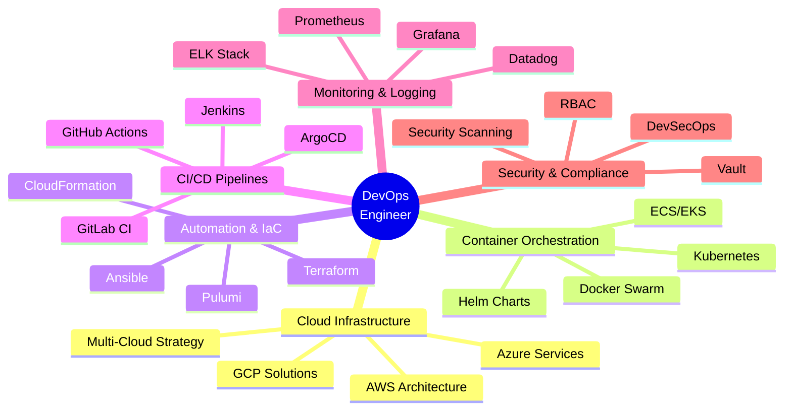

[](https://github.com/SagarBawanthade)
[](https://github.com/SagarBawanthade)
[](https://linkedin.com/in/sagarbawanthade)
[](https://sagardev.kodesesh.cloud)

---

```
sagar@MacBook-Pro ~ % whoami
Sagar Bawanthade - Cloud & DevOps Engineer

sagar@MacBook-Pro ~ % cat personal_info.yml
---
profile:
  name: "Sagar Bawanthade"
  role: "Cloud & DevOps Engineer"
  location: "Pimpri, Maharashtra, India 🇮🇳🇮🇳"
  email: "sagar.bawanthade2004@gmail.com"
  portfolio: "https://sagarbawanthade.dev"
expertise:
  - "☸️ Kubernetes Orchestration & Containers"
  - "🏗️ Infrastructure as Code (Terraform, Ansible)"
  - "☁️ Multi-Cloud Architecture (AWS, Azure, GCP)"
  - "🔄 CI/CD Pipeline Engineering"
  - "🔭 Observability & Monitoring Solutions"
  - "🔒 DevSecOps & Security Best Practices"
philosophy: "Automate Everything. Secure Everything."
current_status:
  working_on: "Infrastructure Automation at Scale 🚀"
  coffee: "Low Sugar ☕"

sagar@MacBook-Pro ~ % echo $DEVOPS_MINDSET
"Build systems that scale, deploy with confidence"

sagar@MacBook-Pro ~ % ./deploy_skills.sh --mode=production
[✓] Deploying cloud expertise...
[✓] Containerizing applications...
[✓] Orchestrating with Kubernetes...
[✓] Automating infrastructure...
[✓] Monitoring systems...
[✓] Securing pipelines...
Deployment successful! All systems operational. 🎉
sagar@MacBook-Pro ~ % ▌
```

---

## 🛠️ Technology Arsenal

### ☁️ Cloud Platforms & Infrastructure


### 🐳 Container & Orchestration


### 🏗️ Infrastructure as Code


### 🔄 CI/CD & Automation


### 📊 Monitoring & Observability


### 💻 Programming & Scripting & Frameworks


### 🗄️ Databases & Caching


### 🌐 Web Servers & Reverse Proxy


### 🛠️ Version Control & Tools


### 🖥️ Operating Systems


---

## 📊 GitHub Analytics Dashboard

[](https://github.com/SagarBawanthade)

[](https://github.com/SagarBawanthade)

---

## 🏆 GitHub Achievements & Trophies

[](https://github.com/SagarBawanthade)

---

## 💼 Professional Journey & Expertise



## 🌟 Featured Projects & Impact

| Project | Project |
|---|---|
| **☸️ Kodesesh – Real-Time Collaborative Code Editor** <br> **Tech:** React, Node.js, Socket.IO, Docker, Kubernetes, NATS <br> ✅ Real-time collaborative coding with live sync <br> ✅ Integrated audio/video communication <br> ✅ Containerized backend & deployed on VPS <br> ✅ Designed scalable cloud-native architecture | **👕 Abhinav's – Clothing Brand Platform** <br> **Tech:** MERN Stack, AWS, Docker <br> ✅ E-commerce platform for a growing clothing brand <br> ✅ Secure authentication & product management <br> ✅ Cloud deployment with scalable backend <br> ✅ Built for future expansion & high traffic |

---

## 🎓 Certifications & Learning

### 📜 Certifications


| Certification | Platform |
|---|---|
| **Kubernetes for Beginners** | *KodeKloud* |
| **Docker for Beginners** | *KodeKloud* |

---

## 🌐 Connect & Collaborate

[](https://linkedin.com/in/sagarbawanthade)
[](https://twitter.com/sagar2004_twts)
[](https://instagram.com/sagar2004_ig)
[](mailto:sagar.bawanthade2004@gmail.com)
[](https://sagardev.kodesesh.cloud)

### 📫 Let's Build Something Amazing!

💼 **Open for:** Cloud and DevOps/SRE Roles | Consulting | Freelance Projects  
🤝 **Available for:** Technical Mentorship | Code Reviews | Architecture Discussions  
☕ **Coffee Chat:** Always up for tech discussions & collaboration

---

### ⭐ From [SagarBawanthade](https://github.com/SagarBawanthade)

**Building Reliable Systems | Automating Infrastructure | Scaling with Confidence**

*One commit at a time, one deployment at a time, one solution at a time.* 🚀
