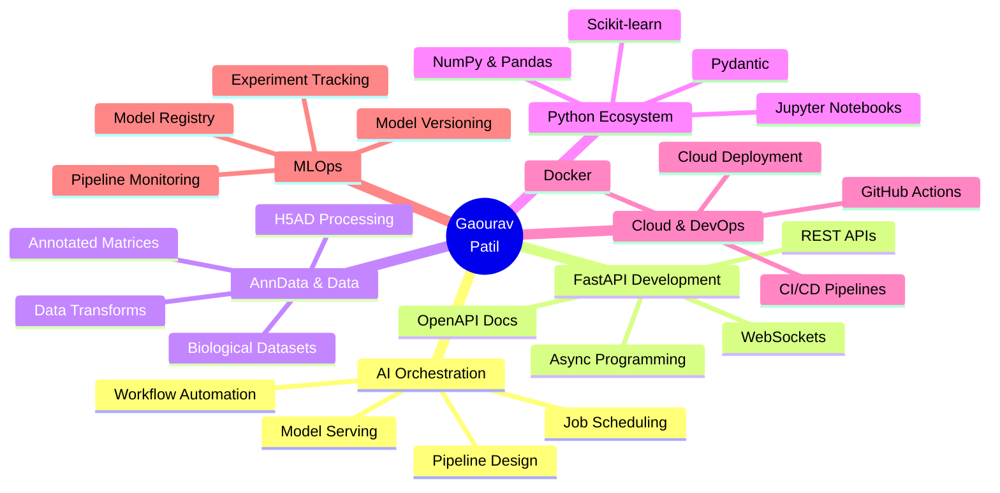

<div align="center">


<br/>

[]([https://linkedin.com/in/gaouravpatil](https://www.linkedin.com/in/gaourav-patil-885695272/))
[](https://github.com/GaouravPatil)
[]([[https://your-portfolio.com](https://portfolio-98j8.onrender.com/)](https://portfolio-98j8.onrender.com/]))
[](mailto:patilgaourav304@gmail.com)

</div>

---

## 👨‍💻 About Me

```python
class GaouravPatil:
    role       = "DevOps Engineer & AI Enthusiast"
    location   = "India 🇮🇳"
    focus      = ["AI Orchestration", "DevOps", "Automation"]
    projects   = ["AI Orchestrator", "AnnData Web Platform"]
    languages  = ["Python", "Go", "Java", "c++"]
    philosophy = "Build smart. Automate more. Ship faster."

    def current_work(self):
        return "AI Orchestrator — FastAPI + AnnData powered ML pipeline platform"

    def fun_fact(self):
        return "I turn messy data into clean AI pipelines ✨"
```

---

## 📊 GitHub Analytics Dashboard

<div align="center">

### 📈 Gaourav Patil's Contribution Graph

[](https://github.com/GaouravPatil)

---

<table>
  <tr>
    <td>
      
    </td>
    <td>
      
    </td>
  </tr>
</table>

### 🔥 Streak Stats

[](https://github.com/GaouravPatil)

</div>

---

## 🏆 GitHub Achievements & Trophies

<div align="center">

[](https://github.com/ryo-ma/github-profile-trophy)

</div>

---

## 💼 Professional Journey & Expertise



---

## 🛠️ Tech Stack & Tools

<div align="center">

**🤖 AI & Machine Learning**


**🗄️ Databases & Storage**


**🐳 DevOps & Cloud**


**🧰 Dev Tools**


</div>

---

## ⭐ Featured Projects & Impact

<div align="center">
<table>
  <tr>
    <td width="50%">
      <h3 align="center">🤖 AI Orchestrator</h3>
      <p align="center">
        <a href="https://github.com/GaouravPatil/ai-orchestrator">
          
        </a>
      </p>
      <p align="center">
        A <b>FastAPI + AnnData</b> powered web platform for orchestrating AI/ML pipelines at scale with real-time monitoring and annotated data support.
      </p>
      <p align="center">
        
        
        
        
      </p>
    </td>
    <td width="50%">
      <h3 align="center">🧬 AnnData Pipeline Hub</h3>
      <p align="center">
        <a href="https://github.com/GaouravPatil/anndata-pipeline-hub">
          
        </a>
      </p>
      <p align="center">
        A modular hub for loading, transforming, and exporting <b>AnnData (.h5ad)</b> files through configurable, reproducible data pipelines.
      </p>
      <p align="center">
        
        
        
        
      </p>
    </td>
  </tr>
  <tr>
    <td width="50%">
      <h3 align="center">⚡ FastAPI Boilerplate</h3>
      <p align="center">
        <a href="https://github.com/GaouravPatil/fastapi-boilerplate">
          
        </a>
      </p>
      <p align="center">
        Production-ready <b>FastAPI project template</b> with JWT auth, PostgreSQL, Redis caching, Docker Compose, and GitHub Actions CI/CD built in.
      </p>
      <p align="center">
        
        
        
        
      </p>
    </td>
    <td width="50%">
      <h3 align="center">📊 ML Pipeline Monitor</h3>
      <p align="center">
        <a href="https://github.com/GaouravPatil/ml-pipeline-monitor">
          
        </a>
      </p>
      <p align="center">
        Real-time <b>ML pipeline monitoring</b> dashboard with WebSocket live updates, job status tracking, and performance metrics visualization.
      </p>
      <p align="center">
        
        
        
        
      </p>
    </td>
  </tr>
</table>
</div>

---

## 🗺️ Current Project Roadmap & Goal

- [x] ✅ Launch **AI Orchestrator v1.0** with FastAPI + AI
- [x] ✅ Build modular AnnData transformation pipeline
- [x] ✅ REST API with JWT auth & OpenAPI docs
- [ ] 🔄 AI Orchestrator **v2.0** — LLM-powered annotation steps
- [ ] 🔄 React-based **Web UI dashboard** for pipeline management
- [ ] 🔄 Publish reusable **PyPI package** for AnnData utilities
- [ ] 🔄 Add **experiment tracking** with MLflow integration
- [ ] 🔄 **Kubernetes-native** deployment with Helm chart

---

## 📬 Let's Connect

<div align="center">

> 💬 *"Always open to AI platform collaborations, interesting Python projects, and open-source contributions!"*

[]([https://linkedin.com/in/gaouravpatil](https://www.linkedin.com/in/gaourav-patil-885695272/))
[](mailto:gaourav@example.com)

---


</div>
